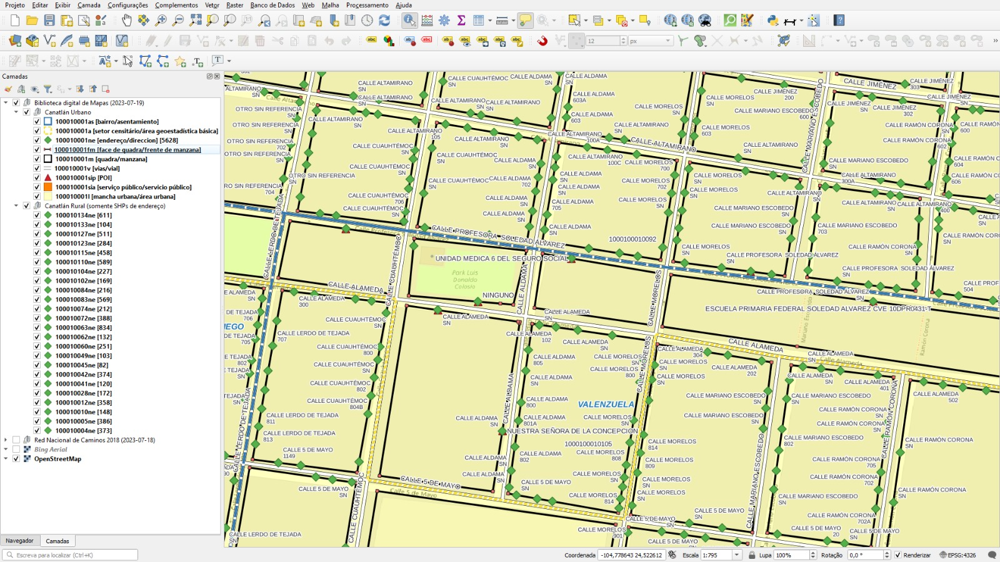

<aside>
<table align="right" style="padding: 1em">
<tr><td>Paquete <a target="_git" title="Enlace canónico a git para este paquete." href="https://git.digital-guard.org/preserv-MX/blob/main/data/_pk0002.01"><big><b>pk0002.01</b></big></a> de <small><a target="_osmcodes" title="Jurisdicción" href="https://osm.codes/MX">MX</a></small>
</td></tr>
<tr><td>
Donante: <a rel="external" target="_doador" href="https://www.inegi.org.mx">Instituto Nacional de Estadística y Geografía</a>
<br/>&nbsp; <small>RFC INE0804164Z7</small> • Wikidata <a rel="external" target="_doador" title="Enlace del descriptor Wikidata del donante" href="https://www.wikidata.org/wiki/Q795074">Q795074</a></small><br/>

Obtido via <i></i> em <b></b> por:
<br/>&nbsp; Avaliação técnica: <a rel="external" target="_gitPerson" title="Usuario de Git" href="https://github.com/0e1">0e1</a>
<br/>&nbsp; Representação institucional: <a rel="external" target="_gitPerson" title="Usuario de" href="https://github.com/ThierryAJean">ThierryAJean</a><br/>
</td></tr>
<tr><td>Camadas: <a title="via" href="#-via"></a> <a title="block" href="#-block"></a> <a title="nsvia" href="#-nsvia"></a> <a title="geoaddress" href="#-geoaddress"></a> </td></tr>

</table>
</aside>

<section>

Este repositorio de metadatos describe un paquete de archivos donados al dominio público. Está siendo conservado por Digital Guard: para obtener más detalles, consulte la [documentación sobre el proceso de registro y conservación](https://wiki.addressforall.org/doc/Documentação_Digital-guard).

Nota. Este documento README fue generado por software a partir de la información contenida en el archivo [`make_conf.yaml`](https://git.digital-guard.org/preserv-MX/blob/main/data/_pk0002.01/make_conf.yaml) en este paquete, e información adicional de los catálogos de [donantes](https://git.digital-guard.org/preserv-BR/blob/main/data/donor.csv) y [paquetes](https://git.digital-guard.org/preserv-BR/blob/main/data/donatedPack.csv).

# Capas de datos

Los archivos contienen "capas de datos" temáticas. Los metadatos también describen cómo se evaluó cada capa y cómo se filtraron sus datos de forma estandarizada.

##  geoaddress

Nombre del archivo: `ne`<br/>*Descarga* e integridad: [d0b51cdba97f9c04eb7e8e4c17695770d66730b895308543781729851e0bd67e.zip](http://dl.digital-guard.org/d0b51cdba97f9c04eb7e8e4c17695770d66730b895308543781729851e0bd67e.zip)<br/>Descripción: Direccion<br/>Formato: shp<br/>SRID: 6362

##  block

Nombre del archivo: `m`<br/>*Descarga* e integridad: [55e32574fbee8b1088979c56dfb44d7f585d94e4677957bb61defa74e7b92377.zip](http://dl.digital-guard.org/55e32574fbee8b1088979c56dfb44d7f585d94e4677957bb61defa74e7b92377.zip)<br/>Descripción: Manzana<br/>Formato: shp<br/>SRID: 6362

##  nsvia

Nombre del archivo: `as`<br/>*Descarga* e integridad: [922fd7121333ca1c08cedf94feaac8ffc08049cd8a51ea05a61dd6581e1554f9.zip](http://dl.digital-guard.org/922fd7121333ca1c08cedf94feaac8ffc08049cd8a51ea05a61dd6581e1554f9.zip)<br/>Descripción: Asentamiento<br/>Formato: shp<br/>SRID: 6362

#### Datos relevantes
* `nomasen` (nsvia): Nombre del asentamiento.

* `cveasen` (ref)

##  via

Nombre del archivo: `v`<br/>*Descarga* e integridad: [09a6131f004f8561b1731e37d805ffd73a6cd0d78c195f15dd9b0827362a6ce5.zip](http://dl.digital-guard.org/09a6131f004f8561b1731e37d805ffd73a6cd0d78c195f15dd9b0827362a6ce5.zip)<br/>Descripción: Vial<br/>Formato: shp<br/>SRID: 6362

# Evidencia de prueba


</section>
<section>

# Reproducibilidad

Consulte los detalles en [reproducibility.sh](https://git.digital-guard.org/preserv-MX/blob/main/data/_pk0002.01/reproducibility.sh).

</section>

# Adjunto

## Proceso utilizado para reagrupar datos convenientemente

1. Preparando la lista de archivos para descargar:

```sh
mkdir arquivos && cd arquivos

grep -E -i '^[0-9]+' Mapas_2023719_214631165.csv | awk -F"[\.,]"  '{print $1","$3","$12}' | sed 's/, /,/g;s/Urbanas/urbana/;s/Rurales/rural/;s/ /_/g' > data.csv
```

2. Script para descargar archivos:

```sh
#! /bin/bash
while IFS="," read -r c1 c2 c3
do
  wget https://www.inegi.org.mx/contenidos/productos/prod_serv/contenidos/espanol/bvinegi/productos/geografia/${c2}/SHP_2/${c3}/${c1}_s.zip
done < data.csv
```

3. Script para generar el sha256 de los archivos descargados:

```sh
#! /bin/bash
while IFS="," read -r c1 c2 c3
do
  sha256=$(sha256sum -b ${c1}_s.zip)
  echo "https://www.inegi.org.mx/contenidos/productos/prod_serv/contenidos/espanol/bvinegi/productos/geografia/${c2}/SHP_2/${c3}/${c1}_s.zip,${sha256}" >> ../sha256_originales.csv
done < ../data.csv
```

4. Descomprimir archivos descargados:

```sh
#! /bin/bash
while IFS="," read -r c1 c2 c3
do
  unzip -o ${c1}_s.zip -d extract1
done < ../data.csv
```

5. Descomprimir archivos comprimidos dentro de archivos comprimidos:

```sh
find arquivos/extract1 -type f -name '*.zip' -exec unzip -o {} -d arquivos/extract2 \; &> logunzip2
find arquivos/extract2 -type f -name '*.zip' -exec unzip -o {} -d arquivos/extract3 \; &> logunzip3
find arquivos/extract1/conjunto_de_datos -type f -name '*.zip' -exec unzip -o {} -d arquivos/extract4 \; &> logunzip4
find arquivos/extract4 -type f -name '*.zip' -exec unzip -o {} -d arquivos/extract5 \; &> logunzip5
```

6. Crear directorios para diferentes tipos de datos:

```sh
mkdir {a,as,fm,l,m,ne,sia,sip,v}

mv a   area_geoestadistica
mv as  asentamiento
mv fm  frente_manzana
mv l   area_urbana
mv m   manzana
mv ne  direccion
mv sia servicio_publico
mv sip poi
mv v   vial
```

7. Mover datos a los directorios respectivos:

```sh
find arquivos -type f \( -name \*sia.shp -o -name \*sia.dbf -o -name \*sia.prj -o -name \*sia.shx -o -name \*sia.shp.xml \) -exec mv -t arquivos_r/servicio_publico {} +
find arquivos -type f \( -name \*sip.shp -o -name \*sip.dbf -o -name \*sip.prj -o -name \*sip.shx -o -name \*sip.shp.xml \) -exec mv -t arquivos_r/poi {} +
find arquivos -type f \( -name \*ne.shp  -o -name \*ne.dbf  -o -name \*ne.prj  -o -name \*ne.shx  -o -name \*ne.shp.xml  \) -exec mv -t arquivos_r/direccion  {} +
find arquivos -type f \( -name \*fm.shp  -o -name \*fm.dbf  -o -name \*fm.prj  -o -name \*fm.shx  -o -name \*fm.shp.xml  \) -exec mv -t arquivos_r/frente_manzana  {} +
find arquivos -type f \( -name \*as.shp  -o -name \*as.dbf  -o -name \*as.prj  -o -name \*as.shx  -o -name \*as.shp.xml  \) -exec mv -t arquivos_r/asentamiento  {} +
find arquivos -type f \( -name \*v.shp   -o -name \*v.dbf   -o -name \*v.prj   -o -name \*v.shx   -o -name \*v.shp.xml   \) -exec mv -t arquivos_r/vial   {} +
find arquivos -type f \( -name \*a.shp   -o -name \*a.dbf   -o -name \*a.prj   -o -name \*a.shx   -o -name \*a.shp.xml   \) -exec mv -t arquivos_r/area_geoestadistica {} +
find arquivos -type f \( -name \*m.shp   -o -name \*m.dbf   -o -name \*m.prj   -o -name \*m.shx   -o -name \*m.shp.xml   \) -exec mv -t arquivos_r/manzana   {} +
find arquivos -type f \( -name \*l.shp   -o -name \*l.dbf   -o -name \*l.prj   -o -name \*l.shx   -o -name \*l.shp.xml   \) -exec mv -t arquivos_r/area_urbana   {} +
```
8. Comprimir archivos:

```sh
zip -r area_geoestadistica.zip area_geoestadistica
zip -r area_urbana.zip area_urbana
zip -r asentamiento.zip asentamiento
zip -r direccion.zip direccion
zip -r frente_manzana.zip frente_manzana
zip -r manzana.zip manzana
zip -r poi.zip poi
zip -r servicio_publico.zip servicio_publico
zip -r vial.zip vial
```

